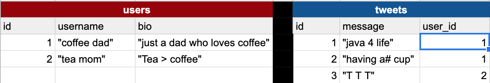

Intro to SQL
===

## SWBATs

* [ ] Explain persistence and the need for using SQL
* [ ] Define SQL
* [ ] Explain the difference between SQLite3 and SQL
* [ ] Explore provided data through SQLite Browser
* [ ] Define CRUD
* [ ] Perform CRUD actions on a single table
* [ ] Perform CRUD actions across related tables

## Outline
* 15 mins: discussion of databases and SQL
* 30 mins: look at a SQL database and write some SQL

## Key Questions
* What can I do with data?
record info, manipulate data, retrieve, store and change data, analytics

- query (ask questions about data), manipulate (update, create, delete)


* Why is persistence important? How have we been persisting data so far?
- variables (local variables, instance, class)
- @@all - single source of truth
- not super efficient to store Ruby memory; also ephemeral (short-lived)

* What is a (relational) database?
- spreadsheet, rows + columns; multiple dimensions (spreadsheet)

* What kinds of databases are there?
  - SQL (relational) - SQLite, Postgresql, MySQL, MSSQL Server, Oracle
  - NoSQL - Mongo Db (document), Redis (key-value), GraphQL

* What is SQL?
Structured Query Language

- declarative / imperative

SELECT * FROM photos WHERE some_column = "some value"

* What is CRUD?

Create - INSERT - create a profile, message, new channel, workspace
Read - SELECT - open a channel, look at a profile, look at messages, filtering (searching) for message
Update - UPDATE - changing your profile photo, edit a message
Delete - DELETE - remove a previous message, delete a channel (archive)

* How does an app like Slack use CRUD?


* How would these domain models translate to SQL tables?

Tweet >- User

**users**
| *id* | *username*   | *bio*                     | *age* |
| 1    | "coffee_dad" | "just a coffee lovin dad" | 55    |
| 2    | "tea_mom"    | "tea > coffee"            | 40    |


**tweets**
| *id* | *message*         | *user_id* |
| 1    | "havin #a coffee" | 1         |
| 2    | "java time"       | 1         |
| 3    | "T for me"        | 2         |


Game -< Review >- Player

**reviews**
game_id
player_id


## Definitions
- **Primary Key**: a *unique* key that identifies one row in a database table.
- **Foreign Key**: a key that is used to link between two tables. Required for setting up a one-to-many relationship. The *foreign key* from one table always refers to a *primary key* from another table.

In the example here:


We have two tables, a *users* table and a *tweets* table. Both the users table and the tweets table have their own *primary key* called *id*. There is also a *foreign key* called *user_id* on the tweets table that refers to the *id* column on the *users* table. That way, we can easily join between them and see which tweets belong to which user.


## Set Up 

1. Install the SQLite Browser if you haven't already [here](http://sqlitebrowser.org/)
2. Open the SQLite Browser and click 'File -> Open DataBase'
3. Choose the `game-reviews.db` file from this repo. 
4. Click the tab that says 'Execute SQL'. Type SQL queries in the box above. Press the play button. See the results of that query in the box below

## Challenges

1. Write the SQL to return all of the rows in the games table
```sql
SELECT *
FROM games;
```

2. Write the SQL to select the game with the title "Super Mario Bros."
```sql
SELECT *
FROM games
WHERE title = "Super Mario Bros.";
```

  2a. Change the query to include all games with the word 'Mario' in their title

  ```sql
SELECT id, title, genre
FROM games
WHERE title like "%mario%";
  ```

3. Write the SQL to display an game's titles next to their review ratings

```sql
SELECT games.*, reviews.*, players.*
FROM games
JOIN reviews ON games.id = reviews.game_id
JOIN players ON players.id = reviews.player_id
WHERE reviews.rating > 5
```

  3a. Write the SQL to show the game title, the review rating, and the player's name

4. Write the SQL to create a review
